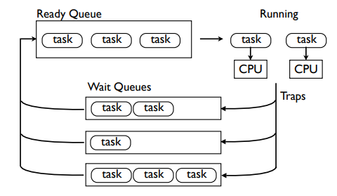

# 数据模型 之 协程对象

[协程对象](https://docs.python.org/zh-cn/3.13/reference/datamodel.html#coroutine-objects)

**参考资料**：

+ [How do coroutines work internally in Python?](https://blog.allegro.tech/2022/01/how-do-coroutines-work-internally-in-python.html) (推荐，通过简单的案例和源码描述了协程的大概的工作原理)
+ [A Curious Course on Coroutines and Concurrency](https://www.dabeaz.com/coroutines/Coroutines.pdf) (一个PPT，讲了协程的设计思想，但是缺乏完整的代码)

**协程实现要点**：

+ **协程基于协作式调度**

  依赖其他协程的结果时暂停，依赖的协程完成后通过事件通知协程恢复。

+ **协程依靠生成器实现事件双向通信**，生成器又是一种特殊的迭代器

  依赖其他协程的结果时，需要发送事件启动依赖的协程，被依赖的协程执行完毕后还要反过来通知结果，这就涉及双向通信。

  双向通信内部依靠 yield 语句（生成器），每个 `yield` 暂时挂起处理流程，记住执行状态的位置。当生成器恢复时，它会从上次暂停的地方继续。

+ **协程通过事件循环（event loop）调度**

  上面提到的通信事件是发给事件循环的，事件循环再根据事件决定启动或恢复哪个协程（去等待事件的任务队列中找等待的协程）。

  事件循环参考 Linux select poll epoll 的原理，本质就是一个循环监听就绪的事件，然后执行就绪事件的处理逻辑。

**协程模拟实现**：

```python
counter = 0


class WaitB:
    def __await__(self):
        yield "B"


class WaitC:
    def __await__(self):
        yield "C"


async def coroutine():
    global counter
    id = counter
    counter += 1

    print(f"{id} Processing event A, blocking on B")
    await WaitB()
    print(f"{id} Processing event B, blocking on C")
    await WaitC()
    print(f"{id} Processing event C, task done")


def app():
    # 等待某事件的任务队列，这里的 coroutine 任务先后等待 B C
    tasks = {"A": [], "B": [], "C": []}
    while True:																	# while 模拟 event loop
        print(f"Task queue size {len(tasks['A'] + tasks['B'] + tasks['C'])}")
        event = input("> ").strip()												# 模拟监听到就绪事件

        if event == "A":
            new_task = coroutine()					# 创建外部任务协程
            waiting_for = new_task.send(None)		# 启动协程，send() 返回挂起的第一个 yield 表达式的值，最初是 "B"
            tasks[waiting_for].append(new_task)		# 记录 new_task 等待 B 事件
            										# 然后会启动 WaitB 异步迭代（可以想像这里WaitB是另一个协程），完成后会返回B事件，下一轮事件循环会读取到B事件

        if len(tasks[event]):			# 第2轮事件循环会读取到 B事件
            task = tasks[event][0]		# 获取等待B事件的协程
            tasks[event].remove(task)
            try:
                waiting_for = task.send(None)	# 恢复之前挂起的协程
                tasks[waiting_for].append(task)	# 发现还会等待 C 事件，再将协程放入等待C事件的任务队列，等待C事件就绪后处理
            except StopIteration:
                pass


if __name__ == "__main__":
    app()
```

结合PPT中的任务调度逻辑图细品：



**然后再看下 aiomysql 中上下文管理器 _ContextManager 的实现** :

```python
class _ContextManager(Coroutine):
    """ 
    实现 __aenter__ __aexit__ 支持 async with 语义
    协程的 send throw close __await__方法的作用：
        send(): 开始或恢复协程的执行
        throw(): 在协程内引发指定的异常
        close(): 使得协程清理自身并退出
        __await__(): 
    """

    __slots__ = ('_coro', '_obj')

    def __init__(self, coro):
        self._coro = coro
        self._obj = None

    def send(self, value):
        return self._coro.send(value)

    def throw(self, typ, val=None, tb=None):
        if val is None:
            return self._coro.throw(typ)
        elif tb is None:
            return self._coro.throw(typ, val)
        else:
            return self._coro.throw(typ, val, tb)

    def close(self):
        return self._coro.close()

    @property
    def gi_frame(self):
        """当前协程正在执行的栈帧（frame）"""
        return self._coro.gi_frame

    @property
    def gi_running(self):
        """协程是否正在运行"""
        return self._coro.gi_running

    @property
    def gi_code(self):
        """协程对应的代码对象"""
        return self._coro.gi_code

    def __next__(self):
        """返回"""
        return self.send(None)

    def __iter__(self):
        """返回迭代器对象，这里返回会返回协程事件的生成器"""
        return self._coro.__await__()

    def __await__(self):
        """允许对象被 await, 表明这是一个 awaitable 对象，这里返回会返回协程事件的生成器"""
        return self._coro.__await__()

    async def __aenter__(self):
        """等待协程执行完成，返回值保存到 _obj, 这里是 Conn"""
        self._obj = await self._coro
        return self._obj

    async def __aexit__(self, exc_type, exc, tb):
        """这里是释放 Conn"""
        await self._obj.close()
        self._obj = None
```

